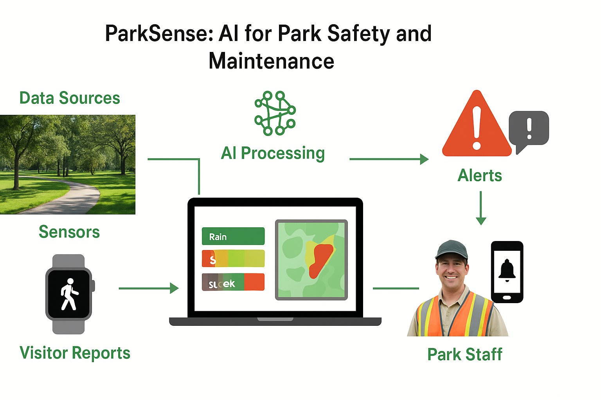

# ParkSense: AI for Park Safety and Maintenance
Building AI Course – AI Project Idea

## Summary

ParkSense predicts safety hazards and maintenance needs in public parks using sensor and visitor data, proactively alerting staff to improve safety and park upkeep.

*Figure: ParkSense predicts hazards and alerts park staff for proactive maintenance.*

## Background

The project addresses these problems:  
* Fallen trees, broken playground equipment, or wet surfaces can cause accidents.  
* Park maintenance teams often rely on manual inspections, which can be slow.  
* Safety incidents and maintenance delays affect public satisfaction.  

**Personal motivation:** Ensuring that local parks are safe and enjoyable for everyone.  
**Importance:** AI can help communities maintain public spaces efficiently and reduce accidents.

## How it is used

1. **Sensors** (motion, weather, camera feeds) collect data on park conditions.  
2. **Visitors** can submit reports via a mobile app about hazards or broken equipment.  
3. **AI** predicts risk areas and schedules maintenance proactively.  
4. **Park staff** receive alerts and can act before problems escalate.  

**Target users:** Municipal park authorities, maintenance teams, and park visitors.  

## Data sources and AI methods

* **Sensor data:** moisture, temperature, motion detectors  
* **Visitor data:** anonymized foot traffic patterns  
* **Optional image data:** public cameras or drones (ethical guidelines applied)  

**AI methods:**  
* Supervised learning for hazard prediction  
* Classification models to detect unsafe conditions  
* Anomaly detection to spot unusual patterns  
* Optional: computer vision for image-based hazard detection

## Challenges

* Cannot prevent accidents completely; only provides alerts.  
* Sensor coverage may be incomplete, causing missed hazards.  
* Ethical considerations: anonymization of visitor data, privacy for any camera use.  
* Weather conditions or sensor failures may reduce accuracy.

## What next:

* Integration with mobile apps to notify visitors of hazards in real-time.  
* Expansion to multiple parks or city-wide implementation.  
* Use of predictive analytics to schedule proactive maintenance.  
* Collaboration with city planners and IoT engineers for better data collection.

## Acknowledgments

* **Smart City IoT inspirations:**  
  - IBM Smarter Cities initiative — [https://www.ibm.com/smarterplanet](https://www.ibm.com/smarterplanet)  
  - Smart Parks Foundation — [https://www.smartparks.org/](https://www.smartparks.org/)  
* **Open-source AI tools:** scikit-learn ([https://scikit-learn.org](https://scikit-learn.org)), NumPy ([https://numpy.org](https://numpy.org)), pandas ([https://pandas.pydata.org](https://pandas.pydata.org))  
* **Data guidelines:** U.S. National Recreation and Park Association Maintenance Management Guidelines ([https://www.nrpa.org](https://www.nrpa.org))
